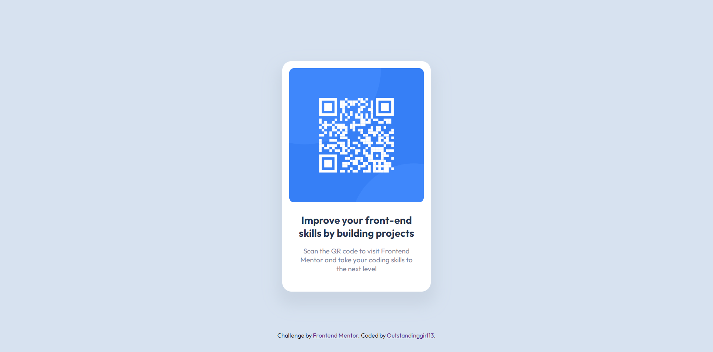

# Frontend Mentor - QR code component solution

This is a solution to the [QR code component challenge on Frontend Mentor](https://www.frontendmentor.io/challenges/qr-code-component-iux_sIO_H). Frontend Mentor challenges help you improve your coding skills by building realistic projects. 

## Table of contents

- [Overview](#overview)
  - [Screenshot](#screenshot)
  - [Links](#links)
- [My process](#my-process)
  - [Built with](#built-with)
  - [What I learned](#what-i-learned)
  - [Continued development](#continued-development)
  - [Useful resources](#useful-resources)
- [Author](#author)


## Overview

### Screenshot




### Links

- Solution URL: [Add solution URL here](https://your-solution-url.com)
- Live Site URL: [Add live site URL here](https://your-live-site-url.com)

## My process

### Built with

- HTML
- CSS


### What I learned

First steps in Frontend development and I am exploring HTML semantic tags :slightly_smiling_face:. My code is more like a mix of non-semantic and semantic elements, so it could probably be modified for the better.

```html
    <section>
        
        <div>
            <h1></h1>
            <p></p>
        </div>
    </section>
```
This time I used an asterisk (*) in the CSS because I needed a universal selector to remove all the default margins and padding. It turned out to be very helpful.
```css
* {
    margin: 0;
    padding: 0;
    box-sizing: border-box;
}
```


### Continued development

- Semantic HTML5 markup
- CSS custom properties
- Flexbox
- CSS Grid
- Javascript
- Typescript

### Useful resources

- [HTML Semantic Elements](https://www.w3schools.com/html/html5_semantic_elements.asp) - This helped me understand what semantic elements are.

## Author

- Website - [Outstandinggirl13](https://github.com/Outstandinggirl13)
- Frontend Mentor - [@Outstandinggirl13](https://www.frontendmentor.io/profile/Outstandinggirl13)


